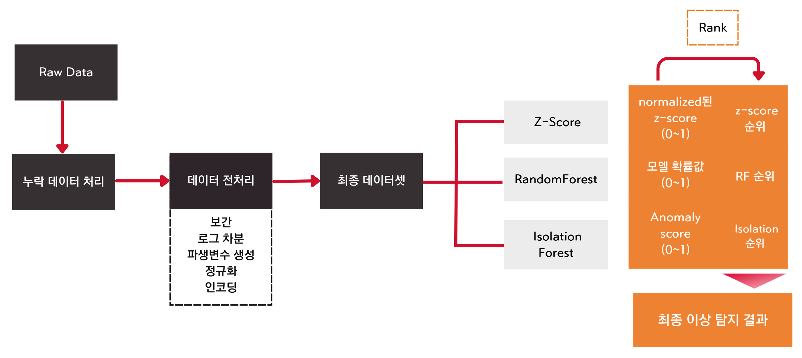

# [프로젝트] 통신 장비 예지보전 및 기지국 관리를 위한 이상탐지 시스템

## 1. 프로젝트 설명

- **프로젝트 기간**: 2023.11.07 ~ 2024.01.07

- **목표**: 시계열 통신 데이터를 기반으로 `다양한 접근법`을 활용하여 `이상 시그널을 탐지`하고 `효율적인 유지 보수`를 지원하는 AI 모델 및 대시보드 개발
    - (배경) 예지 보전(Preventive Maintenance)을 위해서는 정확하고 신속한 이상 탐지 모델이 필수적이며, 이를 통해 현장 유지보수 활동의 효율성을 극대화할 필요가 있음

- **개발 툴** : Python
    - EDA 및 모델링 : Scikit-learn, Matplotlib, Seaborn, Pycaret 
    - 개발 환경 : Google Colab
    - BI 대시보드 : Tableau

- **데이터 소스** : 51개 기지국 통신 장비에서 1시간 단위로 발생한 시그널 데이터
    - (기간) 22.09~22.10 (2개월)
    - (타겟레이블) 통신 기지국 전문가가 라벨링한 y 타겟값
    - (형태) 61607 x 15

- **이상 탐지 파이프라인** :

## **2. 주요 역할 및 기여** : Team Leader

### **(#1) 시계열 데이터 전처리 및 분석 (기여도 80%)**

- (목적) 비정상성을 가진 시계열 데이터를 머신러닝 모델링이 가능하도록 정제

    - (배경) 원본 데이터는 시간 추이에 따라 평균과 분산이 변하는 비정상적인 특성을 가져 독립성을 가정하는 통계적/머신러닝 모델 적용이 어려웠음

        - 관측치 간 자기 상관(Auto-Correlation)이 존재하여 통계적 모델링 가정에 위배 

        - 시간적 종속성 때문에 머신러닝 모델링 과정에서 Data-Leakage 발생 위험이 존재

- (방법1) Spline3 통해 시계열 데이터 결측치 보간 
    - 3차 다항식(cubic) 기반 보간 방식으로 데이터 왜곡 최소화 가능
    - 9가지 보간법(ffill, bfill, linear, poly, spline 등)에 대한 실험을 진행하여 휴리스틱한 의사결정 통해 선정
    
- (방법2) 24시간 로그 차분 적용
    - ADF 통계 검증을 통해 실제 p-value가 안정됨을 확인
    
- (성과) 시계열 전처리로 통계적 모델링 및 머신러닝 학습이 적용 가능한 데이터셋 확보 (이상 탐지 모델링의 신뢰성 강화)

### **(#2) 비즈니스 중심의 이상탐지 파이프라인 설계 (기여도 70%)**

- 비즈니스 요구사항을 반영한 이상탐지 모델 개발
    - 출동 비용을 최소화하면서 예지보전을 진행하고자 하는 현장 전문가의 요구사항을 반영하여 파이프라인 개발 계획 전면 수정
    - `(기존) 탐지 성능 극대화 -> (수정) 탐지 신뢰도 개선` 
    - 개발 계획 수정에 따라 평가 지표 또한 F1 -> F0.5 로 변경

- 다각도 접근법으로 결과의 신뢰성을 강화한 이상탐지 파이프라인 설계
    - 단일 모델이 아닌 3가지 이상탐지 방법론(Z-Score, Classification, Isolation Forest)의 결과를 종합하여 순위  앙상블 적용
    - 8가지 이상탐지 모델을 비교 실험 후, 탐지 성능과 FPR이 최적화된 조합을 도출
    - 현장 전문가의 검토를 통해 이상탐지 기준을 실무에 맞게 최적화
    
- (성과) 출동 비용 30% 절감 + 탐지 신뢰도 개선 (False Alarm 감소)
    > *기존 모델 대비 FN(탐지 누락)과 FP(허위 경고)으로 인한 비즈니스 비용(기회비용 및 다운타임 비용)을 시뮬레이션을 통해 계산*

### **(#3) 전략적인 프로젝트 매니징 (기여도 80%)**

- Due Date 내 성과 도출을 위한 스프린트 관리
    - 프로젝트 중반부터 **`이상탐지 모델링`과 `대시보드 개발` 2개 Sprint로 분리하여 병렬 진행**
    - 매주 (1) 주요 Task 정의, (2) 우선순위 설정, (3) 진행상황 점검 (4) 전문가 피드백 반영 등 Agile한 방식으로 각 Sprint 관리

- 협업 조율을 통한 효율적인 리소스 관리 
    - 2개 스프린트 간 업무 의존성 분석(모델링 작업에서 생성된 데이터가 대시보드 개발에 필요함을 확인) 후 병렬 진행이 가능하도록 마일스톤(일정, 산출물) 관리
    - 대시보드 개발에 필요한 임시 데이터 제공하여 Sprint 간 병목 사전 차단
    - 대시보드 기능 추가 요청으로 데이터 추가 가공이 필요했으나, 일정 지연 없이 즉시 대응

- (성과) 프로젝트 일정 100% 준수, 목표 성능 도달까지 3일 단축하여 추가 최적화 시간 확보

## 3. 주요 성과

- **[ 분류 모델 성능 개선 ]**
    - F0.5 기준, 0.6224의 성능을 달성하여 목표 성능보다 4.7% 향상

- **[ 신뢰성 높은 이상탐지 파이프라인 구축 ]**
    - Z-score, Random Forest, Isolation Forest 모델을 앙상블하여 **73440개의 평가 데이터 중 8812개(12%)**의 이상치 검출

        > *검출 비율은 기지국에서 일반적으로 발생하는 이상 기지국 비율을 기반으로 산정 (전문가 검토)*

- **[ 직관적인 모니터링 시스템 구축]**
    - (1) 지역별/일자별 지표, (2) 이상 기지국 추적, (3) 이상 요인 분석 등 시각화
    - '주변 출동 가능 인력의 위치 정보'까지 포함하여 현장 전문가들이 보다 효과적으로 의사결정을 내릴 수 있도록 지원

## 4. 프로젝트 회고

### 1) 이상탐지 모델링의 개선점 ###

- 7만 개에 불과한 데이터로 모델을 학습하여 계절적 및 연간 패턴을 반영하기 어려웠음. 더 긴 기간의 데이터 확보 시 예측 정확도 향상이 가능했을 것으로 보임.
    
- 또는, 데이터 증강 (노이즈 추가), 합성 데이터 생성(GAN, VAE 등) 등을 통해 데이터 부족 문제와 일반화 성능 향상을 도모할 수 있을 것으로 생각됨. 

- 준지도 학습(Semi-Supervised) : 타겟 레이블이 없는 데이터 확보 또는 데이터 증강 후   

- 보간, 로그 차분 등 시계열 처리 과정에서 시간적 정보에 대한 손실이 발생한 것으로 보임. LAG 변수, Rolling Features(이동평균, 이동표준편차) 등 Static 변수 추가로 시간 패턴 정보를 제공하면 성능 향상이 가능할 것으로 기대

- 하이퍼파라미터 튜닝을 진행했으나 성능 향상이 미미했음. 과적합 때문인지, 파라미터 범위 때문인지 원인 분석이 제대로 진행되지 못하여 아쉬움.

### 2) 산업 도메인 knowledge의 중요성 ###

- 통신 분야의 도메인 지식이 데이터를 이해하고, 모델링 성능을 극대화하기 위한 전략 수립에 필수적임을 경험할 수 있었음. 해당 프로젝트를 진행한 실무자로부터 주요 정보들을 확인할 수 있었지만, 데이터를 이해하고 가공하는 과정에서 시그널 데이터에 대한 정확한 특성을 알기 어려워 실험에 의존하는 휴리스틱한 의사결정이 많았음

- 특히, 대시보드 개발 과정에서 실제 현장 모니터링 과정에서 필수적인 지표(KPI)를 알 수가 없어, 이상탐지 모델링 관점(대시보드 개발자)에서 대시보드 제작이 이루어짐. 사용자 중심(매니저, 엔지니어) 의 인터페이스 및 기능 구현이 이루어지지 못한 아쉬움이 있음

### 3) 프로젝트 개선 사항 ###

- LSTM-AE, GANomaly 등 딥러닝 기반 이상탐지 방법론들에 대해서 성능을 검토해보지 못해 아쉬움이 있음. 특히 LSTM-AE는 시계열 특성을 잘 고려할 수 있는 방법이 될 것이라 생각됨

- 이상 탐지 라는 과업 특성상 Online 학습과 RealTime 예측이 중요한데, 향후 프로젝트를 개선하여 실시간으로 이상 기지국을 탐지하고 이를 대시보드에 반영하는 Online 학습 및 Realtime 예측 PoC로 확장할 계획

## 5. 프로젝트 결과물

- Telecom_AnomalyDetection 디렉토리

- [최종 발표 자료](Telecom_AnomalyDetection\탐지루키최종발표.pdf)

- [프로젝트 발표 영상](https://youtu.be/wfnKyF63EzQ?si=nD5TROL49V8zDJX9)
